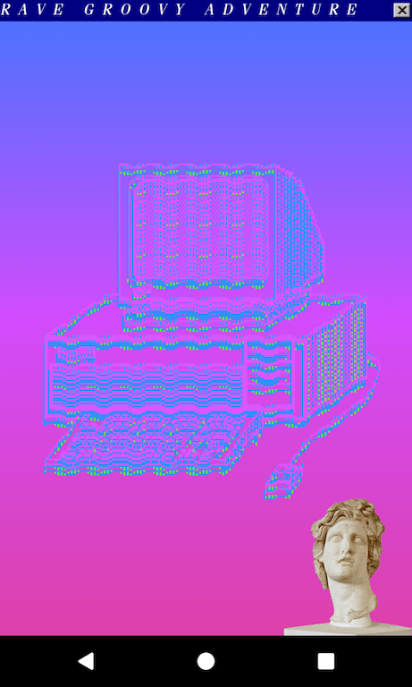

# Rave Groovy Adventure

This is a sample app for [Groovy Android Gradle Plugin](https://github.com/groovy/groovy-android-gradle-plugin). This app is written in Groovy, Kotlin, and Java . This project aim to answer these three questions:


#### 1. Can Java, Groovy, and Kotlin play together?

Well, yes they can!

#### 2. Can I utilize popular Android x Java libraries?

This project use android support libraries, rxjava, picasso, rxjava, volley, gson, picasso, android gif drawable, gpu-image library, calligraphy, and swissknife.

Not all libraries is compatible I guess, I was unable to use Glide, Retrofit, etc. in this project. But for the most part, yes, you can use popular Android / Java libraries.

#### 3. With all the Kotlin craze, what is Google support for Groovy? Afterall Groovy mission is similar to Kotlin, to make Java development *fun* again. Groovy is mature language and Gradle DSL is written in Groovy. Writing an app using Groovy should be easy right?

It's possible, but definitely not easy. At least not easier than Kotlin. Here are some problem I've encountered along the way.

##### 0. Configuration problem
   In the latest `groovy-android-gradle-plugin` documentation, the author suggest to use this configuration.
```groovy
classpath 'com.android.tools.build:gradle:3.0.0'
classpath 'org.codehaus.groovy:groovy-android-gradle-plugin:2.0.0'
```
However it didn't even succeed to compile. In the end I use this configuration for this whole project.

```groovy
classpath 'com.android.tools.build:gradle:2.3.2'
classpath 'org.codehaus.groovy:groovy-android-gradle-plugin:1.2.0'
```

#####  1. R files navigation
  When I want to see the source for a resources file by pressing CMD+B / CMD+Click,
  for example I want to open `R.layout.activity_main` on an Activity,
  Android Studio didn't navigate to that layout, instead it goes to the R file. So, I have to locate the resource file manually.

##### 2. No smart suggestion
  When I'm debugging, I like to log things. Usually I type the following code:
```java
Log.d(TAG, "character" + character.toString())
```
The `TAG` is not defined yet, but that's ok since Android Studio will ask me whether I want to:
- Import from other Class
- Create a constant for `TAG`

For some reason, Android Studio doesn't show any suggestion at all, it even successfully compile!
Needless to say, When the app is launched the app is crashed because of `MissingPropertyException`.
This could have been a compile time problem, not a runtime problem.

Same thing happens when I tried remove a variable, Android Studio didn't mark this variable as uninitialized.
```groovy
// def hello = "Hello world";
textView.setText(hello); // didn't show that hello is undefined
```

This makes me think how dependent I am to Android Studio.

##### 3. Creating new Groovy Class

I tried to create new shortcut in keymap, but it still doing nothing when I press that shortcut. In the end, everytime I want to create a Groovy file I use `create a new file` command or copy existing groovy file.

##### 4. Groovy Cast Exception

When I wrote this code I encounter this error.

```groovy
def thread = new Thread(new Runnable() {
            @Override
            void run() {
                SoundPlayer.INSTANCE.initSounds(getAssets())
            }
        })
```

```
Reference to method is ambiguous. Cannot choose between ContextWrapper.getAssets() and Context.getAssets()
```

The solution is really simple if you already know some Java background.

```groovy
SoundPlayer.INSTANCE.initSounds(RaveApplication.this.getAssets())
```

But this should be prevented by Android Studio. I think I'm too lazy to think about it myself.

##### 6. Instant Run doesn't work sometimes

Android Studio was able to successfully sync and rebuild though.

##### 7. Others..



### Conclusion

I really wish Google put more effort for other JVM language on Android Studio, especially Groovy.

### Credits

- Sound Assets:

http://www.winhistory.de/more/winstart/winstart.htm.en

- Vaporwave Image Stock:

https://summer-to-the-spring.deviantart.com/art/Vaporwave-Png-s-Gifs-Stock-Pack-553847379

### Imaginary FAQ

- Whats is Rave..?

It's a Manga & Anime created by Hiro Mashima. In Indonesia its popular with other name, [Groove Adventure Rave](https://id.wikipedia.org/wiki/Rave_(manga))

- Why Rave..?

I need some sample data for this App. This App is written in Groovy. Rave popular name is... Groove Adventure Rave. Get it? Groov-y Adventure! (I know its a bad pun. I'm not even sorry)
